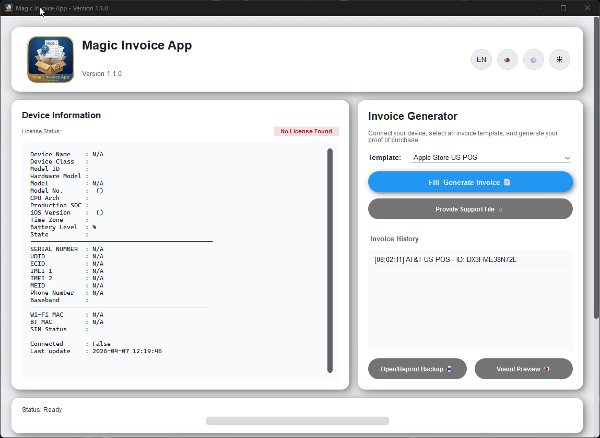

  
  <h1>Magic Invoice App 📱✨</h1>
  
<b>Professional Proof of Purchase (PoP) Recovery Solution for iOS Devices.</b>

  

    
    
    
    
  

---

### 📖 Description
Formerly known as **Magic Invoice Pack**, this project is a specialized suite for **Proof of Purchase (PoP) recovery**. 

Magic Invoice App provides users with the ability to generate legitimate documentation for Apple devices based on real invoice formats. Whether you are managing warranty claims, processing returns, or requiring official documentation for iCloud unlock and "Find My" deactivation, our software generates high-quality **MagicFiles** using industry-standard templates.

### 🛡️ Activation Lock Support Request
Navigating the [Apple Activation Lock support request](https://al-support.apple.com/#/) process is an official legal measure provided by Apple. A successful request requires precise and valid documentation. 

**Magic Invoice App** acts as a critical bridge in this process, helping you organize and generate the exact information Apple requires to verify device ownership and proceed with activation lock removals legally and effectively.

---

  <h2>🚀 Key Features</h2>

* **⚡ Automatic iOS Detection:** Powered by native logic to instantly retrieve Serial Numbers, IMEI, UDID, and Model info via USB connection.
* **📑 Professional Templates:** Currently supports high-fidelity **POS (Point of Sale)** receipt formats.
* **🎨 Modern UI/UX:** A fully modular interface featuring a sleek design and intuitive navigation.
* **🖨️ Advanced Hardware Control:** Integrated printer setup to manage thermal and system printers for physical document output.
* **💎 Data Integrity:** Automated data population into exact templates to fulfill all support expectations.

---

  <h2>📸 Visual Overview</h2>

  <h3>🖥️ Core Functionality</h3>
  <table>
    <tr>
      <td align="center"><b>User Interface</b></td>
      <td align="center"><b>Invoice Generator</b></td>
    </tr>
    <tr>
      <td></td>
      <td></td>
    </tr>
    <tr>
      <td align="center"><i>Clean and modular control panel</i></td>
      <td align="center"><i>Real-time document generation</i></td>
    </tr>
  </table>

  <h3>🎨 Advanced Settings</h3>
  
  
<i>Optimized for focus with granular hardware control.</i>

---

  <h2>🎨 Visual Identity & UI Palette</h2>

To maintain the essence of the **Magic Series**, the interface follows a strict professional color scheme:

- 🌑 **Deep Background:** `#121212` - Used for main containers and dark mode stability.
- 🔵 **Accent Blue:** `#007AFF` - Primary action buttons and device detection status.
- 🟢 **Success Mint:** `#28CD41` - Used for successful MagicFile generation.
- ⚪ **Text Primary:** `#FFFFFF` - High contrast for readability in POS templates.

---

  <h2>🛠️ How it Works</h2>

1.  **Connect:** Plug in your iOS device via USB. The app automatically fetches the hardware identifiers.
2.  **Select:** Choose the appropriate invoice template for your specific case.
3.  **Input:** Fill in the necessary purchase details into our automated fields.
4.  **Generate:** Produce a professional MagicFile ready for official support submissions.

---

  <h2>📢 Important Disclaimer</h2>

> [!IMPORTANT]
> **We do not offer or sell any real personal or corporate information.** Magic Invoice App is a software tool designed to automate the process of inputting **user-provided information** into exact, high-quality templates. The legality of the generated documents depends on the truthfulness of the data provided by the user and its application in legal procedures.

---

  <h2>🛣️ Project Roadmap</h2>

- [x] **POS Support:** Full automation for thermal receipt formats.
- [ ] **A4 Documents:** Support for standard office invoice formats (Coming Soon).
- [ ] **Email Receipts:** Digital proof of purchase templates (Coming Soon).

---

  <h2>💬 Support</h2>
  
<b>We speak Spanish!</b> (<i>Hablamos español</i>).

  
If you have any questions regarding the software or the documentation process, feel free to reach out in English or Spanish.

   
  
<i>Developed for the iOS Community.</i>

