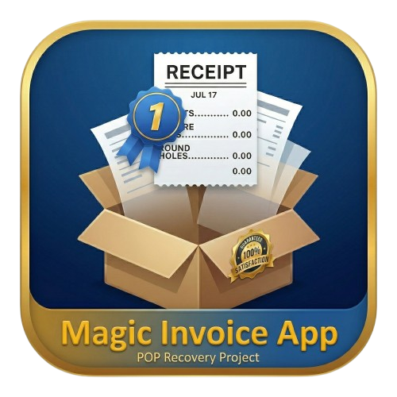
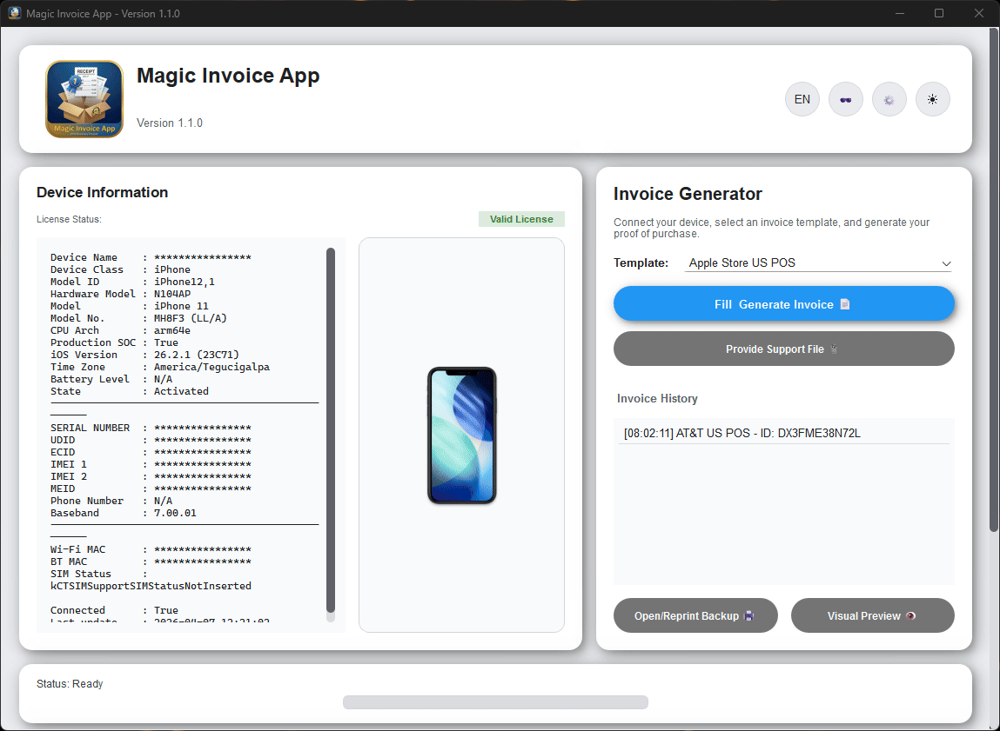

  
  <h1>Magic Invoice App 📱✨</h1>
  
<b>Professional Proof of Purchase (PoP) Recovery Solution for iOS Devices.</b>

  

    
    
    
  

---

> [!NOTE]
> **Evolution of the Project:** Formerly known as **Magic Invoice Pack**, this project has been fully refactored into the **Magic Invoice App** suite, focusing exclusively on high-fidelity **Proof of Purchase (PoP) recovery**.

### 📖 Description
Magic Invoice App provides users with the ability to generate legitimate documentation for Apple devices based on real invoice formats. Whether you are managing warranty claims, processing returns, or requiring official documentation for iCloud unlock and "Find My" deactivation, our software generates high-quality **MagicFiles** using industry-standard templates.

> [!IMPORTANT]
> **A Critical Step for Apple Support:** Navigating the [Apple Activation Lock support request](https://al-support.apple.com/#/) process is an official legal measure. Our software acts as a critical bridge, helping you organize the exact information required by Apple to verify device ownership.

---

  <h2>🚀 Key Features</h2>

* **⚡ Automatic iOS Detection:** Native logic to instantly retrieve Serial Numbers, IMEI, UDID, and Model info via USB connection.
* **📑 Professional Templates:** High-fidelity **POS (Point of Sale)** receipt formats currently supported.
* **🎨 Modern UI/UX:** Fully modular interface featuring a sleek design and intuitive navigation.
* **🖨️ Advanced Hardware Control:** Integrated printer setup to manage thermal and system printers for physical output.

---

  <h2>📄 Physical Output Showcase & Branded Media</h2>

> [!CAUTION]
> **Branded Papers Warning:** Our software provides a 1:1 digital-to-print reproduction of the text and layout. However, many carriers and stores use **Branded Thermal Paper** (rolls with pre-printed logos or legal policies on the back). To achieve 100% fidelity, you must use the original branded paper. These can often be sourced through authorized distributors or specialized resellers.

If you are interested in starting a business reselling authentic thermal paper rolls or have a source to provide them, please contact us at:
👉 **[Magic Store Contact](https://magicstore.qzz.io/)**

  <table align="center">
    <tr>
      <td align="center"><b>Thermal POS Print</b></td>
      <td align="center"><b>Software Showcase</b></td>
    </tr>
    <tr>
      <td></td>
      <td></td>
    </tr>
  </table>

---

  <h2>⚖️ Privacy Policy & Terms of Service</h2>

> [!WARNING]
> **Strict No-Refund Policy:** Access to Magic Invoice App is provided as a service-based product.
> 1. **Service Rendered:** Once a Serial Number (SN) is registered and a document has been printed/generated, the service is considered fully "served."
> 2. **No Refunds:** We do not offer refunds under any circumstances once the service is active. The software is strictly intended to provide the pre-recorded templates as-is.
> 3. **Outcome Responsibility:** Any external results, such as a negative response from Apple Support or third-party entities, are the sole responsibility of the user. Rejection of a support request is **not** a valid reason for a refund or claim.
> 4. **User Responsibility:** You are responsible for the truthfulness of the data you input into the software templates.

---

  <h2>🛠️ Custom Porting & Bug Reporting</h2>

> [!TIP]
> **Dynamic Updates:** Our architecture uses **Definitions**. You don't need a full software update to get new templates. New formats are added as modular files instantly.

### 📤 Provide Support File
If you have a unique carrier format, send us a photo, PDF, or email receipt via the **"Provide Support File"** button. We will port it for you within **24 to 72 hours**.

### 🐛 Bug Reporting (Initial Compilation)
As this is a complex initial build, errors may occur. To help us fix them rapidly:
* **Always provide logs.**
* **Attach screenshots** of the error.
* **Detail the steps** taken before the crash.
* *Patience is mandatory. Abuse towards the staff will result in immediate termination of service by our senior administrators.*

---

  <h2>💬 Support & Business</h2>
  
<b>We speak Spanish!</b> (<i>Hablamos español</i>).

  
For technical support or <b>Business Inquiries (Thermal Paper Sales)</b>, reach out via:

  
🌐 <b>[Official Contact Portal](https://magicstore.qzz.io/)</b>

   
  
<i>Developed with precision for the iOS Community.</i>

